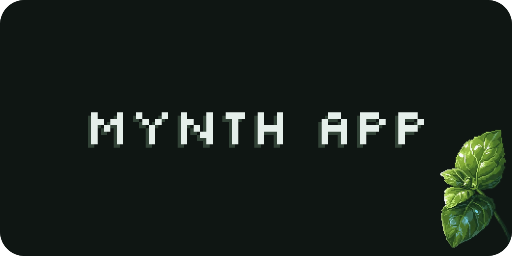

# Mynth Desktop

Local-first AI chat desktop app (Electron Forge + React). Early stage.

## Product docs

- `docs/SKETCHPAD.md` — ideas, open questions, design notes
- `docs/PLAN.md` — concrete implementation plan and milestones
- `docs/TASKS.md` — repo-local tickets (step-by-step)
- `docs/IPC.md` — IPC structure and contributor rules

## Getting Started

```bash
# Install dependencies
pnpm install

# Run app
pnpm start

# Package app
pnpm package

# Build distributables
pnpm make
```

## Linting and formatting (OXC)

```bash
pnpm fmt
pnpm fmt:check
pnpm lint
pnpm lint:fix
```

## Project Structure

```text
src/
  main.ts                 # Electron main entry
  preload.ts              # Electron preload
  main-process/           # Main-process services
    config/               # Global TOML config
    db/                   # Drizzle schema/migrations/runtime
    system/               # OS/user-data paths
  mainview/               # React renderer app
```
